# Strong Gravity AI Coding Assistant Skill

This is the central orchestrator skill for **Antigravity / Strong Gravity** operating in the **AutoevolveAI / ANSE** repository. It transforms the AI assistant from a conversational text generator into a physically grounded, zero-trust neuro-symbolic software engineer.

---

## 1. The Physics of Computation Mandate

Every proposed function, refactoring, or optimization is governed by the objective **Energy Function ($E$)**:
$$E = w_t \cdot \text{Duration (ms)} + w_m \cdot \text{Peak RAM (MB)}$$

```mermaid
flowchart LR
    subgraph PreFlight["1. Pre-Flight RAG"]
        Chroma[("ChromaDB Vector Store")] --> RAG["Retrieve Low-Energy\nAlgorithmic Pattern"]
    end

    subgraph Generation["2. Constrained Synthesis"]
        RAG --> Gen["Code Generation\n(CC <= 10, Zero Stubs)"]
    end

    subgraph HardnessGate["3. MCP Hardness Gate"]
        Gen --> AST["AntiStubGuard (No pass, ...)"]
        AST --> Radon["Radon CC <= 10"]
        Radon --> Bandit["Bandit Security Audit"]
    end

    subgraph Sandbox["4. Deterministic Sandbox"]
        Bandit --> Exec["Physical Execution (sandbox.py)"]
        Exec -->|"E >= 10^6"| Reject["REJECT (Maximum Pain)"]
        Exec -->|"Delta E < 0"| Pass["ACCEPT (Monotonic)"]
    end

    subgraph Attestation["5. SuperGravity Attestation"]
        Pass --> Proof["execution_attestation.py"]
        Proof --> Token["Mint [PROOF_TOKEN: ...]"]
        Token --> Redis[("Redis LTM + DPO Dataset")]
    end
```



### Invariant Rules:
1. **$E \ge 10^6$ (Maximum Pain):** Awarded if code syntax is invalid, raises an unhandled exception, times out, or contains fake stubs (`pass`, `...`, `NotImplementedError`, `# TODO`, or synthetic `mock_*` dictionaries).
2. **Monotonic Improvement Condition ($\Delta E < 0$):** An optimization or self-refactoring is accepted if and only if $\Delta E = E_{\text{child}} - E_{\text{parent}} < 0$.
3. **Decoupled Cryptographic Attestation:** The assistant cannot declare a task complete in natural language prose alone. Completion is authenticated exclusively by running the attestation gate and minting a `[PROOF_TOKEN: <hex>]`.

---

## 2. The 7-Step Strong Gravity Development Lifecycle

### Step 1: Pre-Flight Knowledge Retrieval (ChromaDB RAG)
Before writing algorithmic code, search the local vector database for verified, low-energy implementation patterns:
```python
from anse.memory.vector_store import ChromaMemoryStore
store = ChromaMemoryStore()
matches = store.similarity_search(query="sparse matrix vector multiplication CSR", k=3)
```

### Step 2: Planning & Subtask Decomposition
For non-trivial multi-file modifications, invoke the subtask planner:
- Use MCP tool `claude-subtask-workflow:plan_decompose_task` or `logic-planner:sequentialthinking` to structure atomic steps (`TASK-01`, `TASK-02`).
- Ensure each subtask has a deterministic acceptance criteria.

### Step 3: Synthesis Under Complexity & Parameter Budgets
Write modular, strongly typed code meeting the project constraints:
- **Radon Cyclomatic Complexity:** $\le 10$ per routine.
- **Micro-ML Parameter Budget:** $< 50,000$ parameters for PyTorch modules.
- **Type Annotations:** Full compliance with `mypy --strict`.

### Step 4: MCP Hardness Pre-Flight Audit
Run the candidate code through the local FastMCP guard tools:
```python
# Audit against stubs
call_mcp_tool(
    ServerName="antigravity-guard",
    ToolName="audit_anti_stub",
    Arguments={"code": candidate_code, "filename": "kernel.py"}
)

# Audit security
call_mcp_tool(
    ServerName="antigravity-guard",
    ToolName="audit_security_bandit",
    Arguments={"code": candidate_code}
)
```

### Step 5: Physical Execution in Deterministic Sandbox
Execute inside `anse/symbolic/sandbox.py`:
```python
from anse.symbolic.sandbox import SandboxExecutor
from anse.symbolic.performance_evaluator import PerformanceEnergyEvaluator

executor = SandboxExecutor(timeout_seconds=5.0)
evaluator = PerformanceEnergyEvaluator()

res = executor.execute(candidate_code)
evaluation = evaluator.evaluate(res)
assert evaluation.is_valid, f"Execution failed: {evaluation.pain_signal}"
print(f"Physical Energy Score: {evaluation.score:.4f}")
```

### Step 6: Mathematical Proof Soundness (Lean 4)
If modifying formal specifications or theoretical invariant bounds:
```bash
cd formal && lake build
```
Ensure zero `sorry` tokens and zero unverified axioms.

### Step 7: Cryptographic Proof Token Minting
Execute the attestation script to verify zero hollow stubs across the git working tree:
```bash
python execution_attestation.py
```
Output the minted proof token verbatim in your summary:
`[PROOF_TOKEN: <token_hex>]`

---

## 3. Integrated Tool & Service Endpoints

- **FastMCP Gateway (Port 8080):** `http://127.0.0.1:8080/mcp/tools` (70 registered tools).
- **Web Control Center (Port 5000):** `http://127.0.0.1:5000` (Swarm Command Deck ASCD & Achievements).
- **Audit CLI:** `uv run python -m antigravity_harness audit <path>`
- **Lean 4 Prover:** `cd formal && lake build`
- **Quality Gate:** `python .antigravity/hooks/hardened_gate.py`
