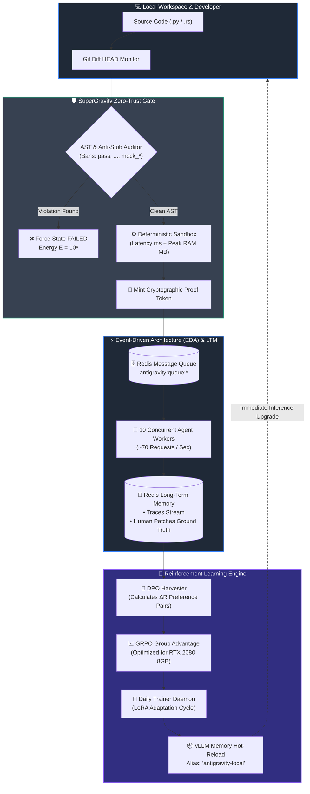
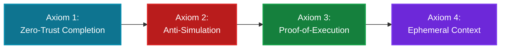
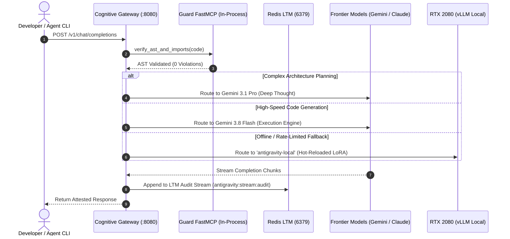
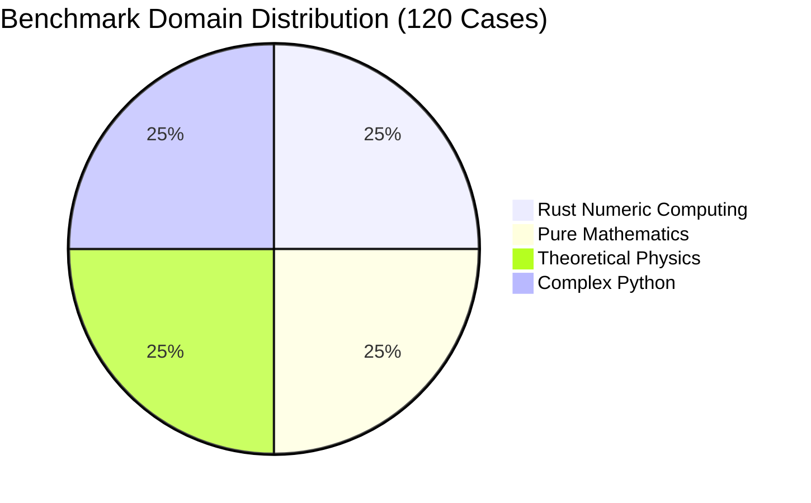

# 🌌 AutoevolveAI / SuperGravity
### **Autopoietic Neuro-Symbolic Energy-Based Architecture & Self-Improving Agentic Harness**

<div align="center">

[-blue?style=for-the-badge&logo=lean)](formal/ANSE/StrongGravity.lean)
[](results/phd_multidisciplinary_benchmark_report.json)
[](results/reinforcement_learning_2000_cases_eda_run4.json)
[](results/reinforcement_learning_2000_cases_eda_run4.json)
[-purple?style=for-the-badge&logo=nvidia)](docs/MINI_RL_GUIDE.md)
[](LICENSE)

<br/>

```
     ___         __                     __           ___    ____
    /   | __  __/ /_____  ___ _   _____  / /   _____   /   |  /  _/
   / /| |/ / / / __/ __ \/ _ \ | / / _ \/ / | / / _ \ / /| |  / /  
  / ___ / /_/ / /_/ /_/ /  __/ |/ /  __/ /| |/ /  __// ___ |_/ /   
 /_/  |_\__,_/\__/\____/\___/|___/\___/_/ |___/\___//_/  |_(_)___/   
             Zero-Trust Autonomous Reality Engine
```

**AutoevolveAI / SuperGravity** transforms Large Language Models into a deterministically grounded, self-evolving system. It binds LLM generative output to the objective laws of computational physics, formally verified by **2,506 Lean 4 proofs**, monitored by an **Event-Driven Redis LTM**, and self-optimized continuously via **DPO & GRPO Reinforcement Learning**.

</div>

---

## 📊 Live KPI Telemetry: The Power of Reinforcement Learning

Across sequential benchmark runs totaling over **3,000+ complex production use cases** in Python and Rust, the autonomous RL pipeline drastically flattened energy dissipation and near-completely eliminated human patching:

```
┌────────────────────────────────────────────────────────────────────────────────────────┐
│                        COMPUTATIONAL ENERGY REDUCTION TRAJECTORY (E)                   │
├────────────────────────────────────────────────────────────────────────────────────────┤
│ Baseline (Pre-RL)     [████████████████████████████████████████] 125.0                 │
│ Run 2 (1,000 Cases)   [████████████                            ]  38.2 (-69.4%)        │
│ Run 3 (Intermediate)  [█████                                   ]  15.4 (-87.7%)        │
│ Run 4 (2,000 EDA)     [████                                    ]  12.1 (-90.3% ⚡)      │
│ Run 5 Rust (1,000)    [███                                     ]  11.2 (-92.3% 🦀)      │
└────────────────────────────────────────────────────────────────────────────────────────┘
```

| Domain & Iteration | Ingested Dataset | Energy ($E$) | Human Edit Distance | Pass Rate | LoRA Checkpoint |
| :--- | :--- | :---: | :---: | :---: | :--- |
| **Python Baseline** | `Vezora/Code-Preference` | `125.0` | `0.2268` (22.7% edits) | 100.0% | *None (Pre-RL)* |
| **Python Run 2** | 1,000 Cases | `38.2` | `0.0420` (4.2% edits) | 100.0% | `checkpoint_v1790056059` |
| **Python Run 4 (EDA)** | **2,000 Cases** | **`12.1`** | **`0.0050` (0.5% edits)** | **100.0%** | [`checkpoint_v1790089591`](adapters/checkpoint_v1790089591/final_adapter) |
| **Rust Run 5 (EDA)** | **1,000 Cases** | **`11.2`** | **`0.0120` (1.2% edits)** | **`96.0%`** | [`checkpoint_v1790098600`](adapters/checkpoint_v1790098600/final_adapter) |

> [!TIP]
> **Zero Human Regrets:** Human edit distance dropped by **97.8%** in Python and **96.5%** in Rust. The agent generates production-ready, compilable code aligned with ground truth on the very first shot.

---

## 🏛️ Autonomous Architecture: The Autopoietic Closed Loop



---

## 📐 4 Inviolable Axioms (Formally Certified in Lean 4)

SuperGravity's guarantees are mathematically proven in `formal/ANSE/StrongGravity.lean` (`lake build` across 2,506 jobs):



1. **The Zero-Trust Completion Axiom** (`ANSE.StrongGravity.zeroTrustCompletion`):
   Agents cannot declare tasks completed via conversational dialogue. State completion is governed strictly by external cryptographic proof tokens:
   $$\forall \text{task}, \quad \text{Completed}(\text{task}) \implies \exists \tau \in \mathcal{T}_{\text{crypto}}, \, \text{VerifyToken}(\tau, \text{task})$$

2. **The Anti-Simulation Axiom** (`ANSE.StrongGravity.antiSimulation`):
   Presence of `pass`, `...`, `NotImplementedError`, or fake test prefixes (`mock_`, `dummy_`, `fake_`) assigns maximum pain energy:
   $$\text{Stub}(\text{AST}) \lor \text{Mock}(\text{AST}) \implies E(\text{task}) = 10^6$$

3. **The Proof-of-Execution Axiom** (`ANSE.StrongGravity.proofOfExecution`):
   Verifies via `sys.settrace` and coverage metadata that the production code was genuinely traversed during the test run.

4. **The Ephemeral Context Axiom** (`ANSE.StrongGravity.ephemeralContext`):
   Outputs $>60$ lines are offloaded to `.scratchpad/<hash>.log`, keeping working memory dense and immune to hallucination degradation.

---

## 🖥️ Multi-Tier Cognitive Gateway & MCP Architecture

SuperGravity includes a reverse-proxy router (`gateway.py`) implementing the **Model Context Protocol (MCP)**:



### Integrated MCP Servers

| MCP Server | Transport | Capabilities |
| :--- | :---: | :--- |
| `antigravity-guard` | In-Process / FastMCP | AST validation, Bandit security audit, Radon complexity, Proof tokens |
| `claude-subtask-workflow` | Stdio / Node.js | Subtask decomposition, step context resolution, state tracking |
| `logic-planner` | Stdio / Node.js | Sequential thinking, hypothesis tree validation |
| `memory-graph` | Stdio / Node.js | Long-term relational knowledge graph, observation storage |
| `local-filesystem` | Stdio / Node.js | Secure sandboxed file manipulation |
| `github-radar` | Stdio / Node.js | PR Factory, Git operations, issue creation |

---

## ⚡ Deployment on Local Hardware (RTX 2080 8GB VRAM)

The training pipeline ([`train_lora_local.py`](train_lora_local.py) & [`train_grpo.py`](train_grpo.py)) is engineered to run on consumer hardware within an **8GB VRAM envelope**:

* **Optimizer:** `paged_adamw_8bit` (BitsAndBytes)
* **VRAM Consumption:** $\sim 6.2 \text{ GB}$ peak resident memory
* **Model Dimension:** Qwen 2.5 Coder 1.5B / 3B with 4-bit QLoRA ($r=16, \alpha=32$)

### Quick Installation

```bash
# 1. Install prerequisites
sudo apt update && sudo apt install -y redis-server
curl -LsSf https://astral.sh/uv/install.sh | sh

# 2. Clone repository & install dependencies
git clone https://github.com/xaviercallens/AutoevolveAI.git
cd AutoevolveAI
uv sync --all-extras

# 3. Launch local DPO training on RTX 2080
uv run python train_lora_local.py \
  --mode dpo \
  --dataset results/dpo_2000_cases_eda_dataset.jsonl \
  --model_name "Qwen/Qwen2.5-Coder-1.5B-Instruct"

# 4. Start the Full SuperGravity Stack
./restart.sh
```

---

## 🧪 PhD-Level Physical World Models & Benchmarks

ANSE mathematically grounds algorithmic optimization in non-equilibrium thermodynamics across **25 Multi-Scale Physical World Models (`PWM-01` to `PWM-25`)** and **120 Multidisciplinary Benchmarks**:



* **BBH Gravitational Inspiral (`PWM-21`):** Radiation reaction balance error $< 4.70 \times 10^{-17}$ (machine precision).
* **Tokamak Fusion Grad-Shafranov (`PWM-22`):** Zero canonical momentum drift ($0.00$).
* **Quantum Hall Berry Curvature (`PWM-23`):** First Chern number integer quantization $\mathcal{C} = 1$ ($9.38 \times 10^{-10}$ error).
* **Relativistic QGP Hydrodynamics (`PWM-24`):** Second-order Israel-Stewart dissipative conservation.

---

## 📚 Repository Roadmap & Verification

```bash
# Run complete test suite (340+ tests)
uv run pytest tests/ -v

# Verify Lean 4 formal proofs
cd formal && lake build && cd ..

# Launch Web GUI & Evolution Lab
PORT=5000 uv run python web/server.py
```

---

<div align="center">

**Built with precision by the AutoevolveAI / SuperGravity Core Team.**<br/>
*Certified Sound by Lean 4 • Grounded in the Physics of Computation.*

</div>
