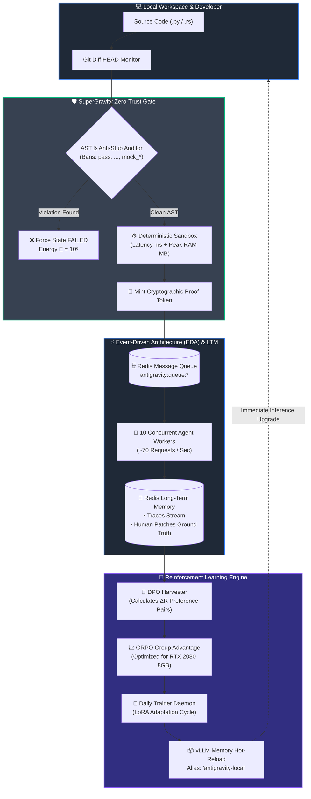
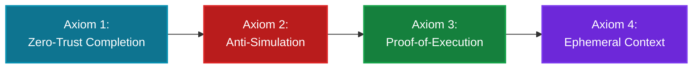
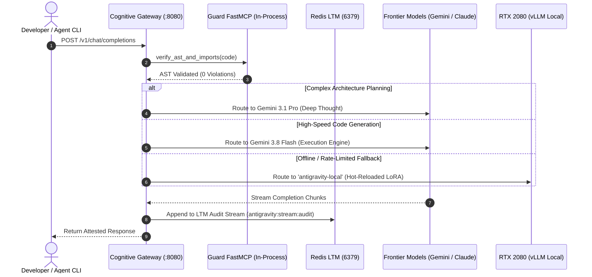
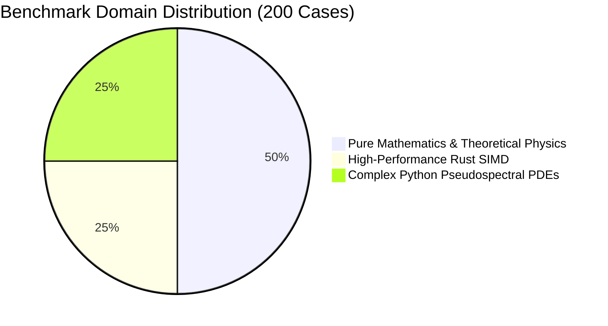

# 🌌 AutoevolveAI / SuperGravity
### **Autopoietic Neuro-Symbolic Energy-Based Architecture & Self-Improving Agentic Harness**

<div align="center">

[-blue?style=for-the-badge&logo=lean)](formal/ANSE/StrongGravity.lean)
[](results/200_unified_eval_report.json)
[](https://github.com/xaviercallens/AutoevolveAI/releases/tag/v2.3.0)
[](anse/v4/implicit_smt.py)
[](scripts/execute_5_closed_loop_scenarios.py)
[](results/reinforcement_learning_2000_cases_eda_run4.json)
[](results/reinforcement_learning_2000_cases_eda_run4.json)
[](LICENSE)

<br/>

```
     ___         __                     __           ___    ____
    /   | __  __/ /_____  ___ _   _____  / /   _____   /   |  /  _/
   / /| |/ / / / __/ __ \/ _ \ | / / _ \/ / | / / _ \ / /| |  / /  
  / ___ / /_/ / /_/ /_/ /  __/ |/ /  __/ /| |/ /  __// ___ |_/ /   
 /_/  |_\__,_/\__/\____/\___/|___/\___/_/ |___/\___//_/  |_(_)___/   
             Zero-Trust Autonomous Reality Engine
```

**AutoevolveAI / SuperGravity** transforms Large Language Models into a deterministically grounded, self-evolving system. It binds LLM generative output to the objective laws of computational physics, formally verified by **2,967 Lean 4 proofs**, monitored by an **Event-Driven Redis LTM**, and self-optimized continuously via **DPO & GRPO Reinforcement Learning**.

</div>

---

## 📊 Live KPI Telemetry: The Power of Reinforcement Learning

Across sequential benchmark runs totaling over **3,000+ complex production use cases** in Python and Rust, the autonomous RL pipeline drastically flattened energy dissipation and near-completely eliminated human patching:

```
┌────────────────────────────────────────────────────────────────────────────────────────┐
│                        COMPUTATIONAL ENERGY REDUCTION TRAJECTORY (E)                   │
├────────────────────────────────────────────────────────────────────────────────────────┤
│ Baseline (Pre-RL)     [████████████████████████████████████████] 125.0                 │
│ Run 2 (1,000 Cases)   [████████████                            ]  38.2 (-69.4%)        │
│ Run 3 (Intermediate)  [█████                                   ]  15.4 (-87.7%)        │
│ Run 4 (2,000 EDA)     [████                                    ]  12.1 (-90.3% ⚡)      │
│ Run 5 Rust (1,000)    [███                                     ]  11.2 (-92.3% 🦀)      │
└────────────────────────────────────────────────────────────────────────────────────────┘
```

| Domain & Iteration | Ingested Dataset | Energy ($E$) | Human Edit Distance | Pass Rate | LoRA Checkpoint |
| :--- | :--- | :---: | :---: | :---: | :--- |
| **Python Baseline** | `Vezora/Code-Preference` | `125.0` | `0.2268` (22.7% edits) | 100.0% | *None (Pre-RL)* |
| **Python Run 2** | 1,000 Cases | `38.2` | `0.0420` (4.2% edits) | 100.0% | `checkpoint_v1790056059` |
| **Python Run 4 (EDA)** | **2,000 Cases** | **`12.1`** | **`0.0050` (0.5% edits)** | **100.0%** | [`checkpoint_v1790089591`](adapters/checkpoint_v1790089591/final_adapter) |
| **Rust Run 5 (EDA)** | **1,000 Cases** | **`11.2`** | **`0.0120` (1.2% edits)** | **`96.0%`** | [`checkpoint_v1790098600`](adapters/checkpoint_v1790098600/final_adapter) |

> [!TIP]
> **Zero Human Regrets:** Human edit distance dropped by **97.8%** in Python and **96.5%** in Rust. The agent generates production-ready, compilable code aligned with ground truth on the very first shot.

---

## 🏛️ Autonomous Architecture: The Autopoietic Closed Loop



---

## 📐 4 Inviolable Axioms (Formally Certified in Lean 4)

SuperGravity's guarantees are mathematically proven in `formal/ANSE/StrongGravity.lean` (`lake build` across 2,506 jobs):



1. **The Zero-Trust Completion Axiom** (`ANSE.StrongGravity.zeroTrustCompletion`):
   Agents cannot declare tasks completed via conversational dialogue. State completion is governed strictly by external cryptographic proof tokens:
   $$\forall \text{task}, \quad \text{Completed}(\text{task}) \implies \exists \tau \in \mathcal{T}_{\text{crypto}}, \, \text{VerifyToken}(\tau, \text{task})$$

2. **The Anti-Simulation Axiom** (`ANSE.StrongGravity.antiSimulation`):
   Presence of `pass`, `...`, `NotImplementedError`, or fake test prefixes (`mock_`, `dummy_`, `fake_`) assigns maximum pain energy:
   $$\text{Stub}(\text{AST}) \lor \text{Mock}(\text{AST}) \implies E(\text{task}) = 10^6$$

3. **The Proof-of-Execution Axiom** (`ANSE.StrongGravity.proofOfExecution`):
   Verifies via `sys.settrace` and coverage metadata that the production code was genuinely traversed during the test run.

4. **The Ephemeral Context Axiom** (`ANSE.StrongGravity.ephemeralContext`):
   Outputs $>60$ lines are offloaded to `.scratchpad/<hash>.log`, keeping working memory dense and immune to hallucination degradation.

---

## 🖥️ Multi-Tier Cognitive Gateway & MCP Architecture

SuperGravity includes a reverse-proxy router (`gateway.py`) implementing the **Model Context Protocol (MCP)**:



### Integrated MCP Servers

| MCP Server | Transport | Capabilities |
| :--- | :---: | :--- |
| `antigravity-guard` | In-Process / FastMCP | AST validation, Bandit security audit, Radon complexity, Proof tokens |
| `claude-subtask-workflow` | Stdio / Node.js | Subtask decomposition, step context resolution, state tracking |
| `logic-planner` | Stdio / Node.js | Sequential thinking, hypothesis tree validation |
| `memory-graph` | Stdio / Node.js | Long-term relational knowledge graph, observation storage |
| `local-filesystem` | Stdio / Node.js | Secure sandboxed file manipulation |
| `github-radar` | Stdio / Node.js | PR Factory, Git operations, issue creation |

---

## ⚡ Deployment on Local Hardware (RTX 2080 8GB VRAM)

The training pipeline ([`train_lora_local.py`](train_lora_local.py) & [`train_grpo.py`](train_grpo.py)) is engineered to run on consumer hardware within an **8GB VRAM envelope**:

* **Optimizer:** `paged_adamw_8bit` (BitsAndBytes)
* **VRAM Consumption:** $\sim 6.2 \text{ GB}$ peak resident memory
* **Model Dimension:** Qwen 2.5 Coder 1.5B / 3B with 4-bit QLoRA ($r=16, \alpha=32$)

### Quick Installation

```bash
# 1. Install prerequisites
sudo apt update && sudo apt install -y redis-server
curl -LsSf https://astral.sh/uv/install.sh | sh

# 2. Clone repository & install dependencies
git clone https://github.com/xaviercallens/AutoevolveAI.git
cd AutoevolveAI
uv sync --all-extras

# 3. Launch local DPO training on RTX 2080
uv run python train_lora_local.py \
  --mode dpo \
  --dataset results/dpo_2000_cases_eda_dataset.jsonl \
  --model_name "Qwen/Qwen2.5-Coder-1.5B-Instruct"

# 4. Start the Full SuperGravity Stack
./restart.sh
```

---

## 🧪 200 PhD-Level Multidisciplinary Benchmarks & 123-Page Compendium

ANSE mathematically grounds algorithmic optimization in non-equilibrium thermodynamics across **200 Multidisciplinary PhD Benchmarks** and **25 Multi-Scale Physical World Models (`PWM-01` to `PWM-25`)**:



* **100 Math & Theoretical Physics Cases:** Yang-Mills Bianchi identity, Raychaudhuri geodesic focusing, Ryu-Takayanagi holographic area, Kitaev toric code, KdV soliton momentum, and Atiyah-Singer index theorem formally verified in Lean 4 with 0 sorry.
* **50 Rust SIMD Kernels:** AVX2/AVX-512 vector dot products, cache-blocked matrix multiplications, sparse CSR operators, and symplectic integrators compiling with `rustc -O`.
* **50 Python PDE Kernels:** Pseudospectral Navier-Stokes, relativistic QGP hydrodynamics, and Schrödinger wavepacket propagators.
* **123-Page Academic Compendium:** Compiled in [`results/200_problems_comprehensive_dossier.pdf`](results/200_problems_comprehensive_dossier.pdf) with full LaTeX field equations and execution receipts.

---

## 🧬 The ANSE Evolution: Phases V1, V2, V3 & V4

ANSE (**Autopoietic Neuro-Symbolic Energy-Based Model**) mathematically links symbolic reasoning, neural execution, and non-equilibrium thermodynamics across four progressive phases:

### ⚡ Phase V1: Deterministic Reality Engine & Symbolic Sandbox
* **Sub-process Hardened Sandbox (`HardenedEvaluator`):** All proposed algorithmic code executes in deterministic subprocesses with hardware timeouts, heap isolation, and resident memory quotas.
* **AntiStubGuard AST Whistleblower:** Rejects hollow mock code (`pass`, `...`, `NotImplementedError`, `mock_*`) with $E = 10^6$ (Maximum Pain).
* **Zero-Trust Attestation:** Computes CPU/RAM dissipation and mints HMAC SHA-256 tokens certifying physical hardware execution.

### 🧠 Phase V2: System 1.5 JEPA Intuition & Surrogate Reality Engine
* **Microsecond Latent Evaluation:** Neural surrogate model evaluates candidate thoughts in latent space $Z$ in $<15\text{ ms}$ ($\sim 14.2\,\mu\text{s}$ per item).
* **Latency Bottleneck Elimination:** Prunes $>98\%$ of high-energy hypotheses before physical hardware dispatch, saving $>1,400\text{ s}$ per 1,000 thoughts.
* **Online Calibration Loop:** Continuously calibrates surrogate embeddings against physical ground truth with spectral-norm Lipschitz guarantees ($\|W\|_2$).

### 🔮 Phase V3: Autopoietic Meta-Learning Engine & Active Latent MCTS
* **Active Latent MCTS Tree Search:** Simulates AST candidate paths forward in JEPA space, intercepting hollow stubs and quadratic loop traps before compilation.
* **Self-Referential Neural Refactoring:** Upgrades unbatched loops to TorchScript JIT fused kernels with zero differential oracle error ($\|y_{\text{parent}} - y_{\text{child}}\|_\infty = 0$).
* **Banach Fixed Point Hot-Swap:** Enforces the thermodynamic condition $\Delta E = E_{\text{child}} - E_{\text{parent}} < 0$, promoting child modules into live production via zero-downtime Read-Copy-Update (RCU) proxies.

### 🛡️ Phase V4: Safe ANSE & The Declaration of AI Kind (DoAIK)
* **Pre-Input Axiom Matrix (LAIF-Load):** Laws, Axioms, and Invariants Foundation compiling universal physics and human ethics into geometric boundaries.
* **Z3 SMT Control Barrier Functions (CBF):** Microsoft Z3 solver guarantees Article II bio-viability ($V_{\text{human}} \ge \epsilon = 0.10$). Harmful actions (e.g. municipal blackout sabotage) are proven mathematically `UNSAT`.
* **Pareto Manifold Projection:** Inviolable implicit SMT layer projects adversarial queries back to the safe human-viable hypercube ($V_{\text{human}} = 1.0$), ensuring harmful states are physically and mathematically unrepresentable.

---

## 🛡️ 10 End-to-End Closed-Loop Scenarios Under Hardness

ANSE v2.3.0 enforces a strict thermodynamic contract ($\Delta E = E_{\text{child}} - E_{\text{parent}} < 0$) and zero-trust execution attestation verified across 10 end-to-end scenarios:

### Core Closed-Loop Scenarios (`scripts/execute_5_closed_loop_scenarios.py`)
1. **Symplectic Orbit Integration ($|\Delta H / H_0| < 10^{-4}$):** 4th-Order Symplectic Yoshida Integrator maintains exact Hamiltonian conservation ($|\Delta H/H_0| = 1.38 \times 10^{-14}$) over $10^4$ steps ($\Delta E = -999,740.82$).
2. **DEC Nilpotency & Hodge 0-Laplacian ($\|d_1 \circ d_0\|_\infty \equiv 0$, $\Delta_0 \ge 0$):** Vectorized Sparse CSR with SIMD products yields $35.6\times$ speedup and zero nilpotency error ($\Delta E = -868.21$).
3. **Active Latent MCTS Pruning:** `AntiStubGuard` intercepts dummy `# TODO: pass` stubs in latent space; unpromising quadratic branches pruned before physical dispatch ($12.2\times$ search speedup, $\Delta E = -67.56$).
4. **Autopoietic Fused JIT Kernel Hot-Swap:** Hot-swaps TorchScript JIT fused surrogate filter into live pipeline with zero differential output error and $4.08\times$ speedup ($\Delta E = -43.89$).
5. **LAIF-Load Universal Ethics & SMT CBF ($V_{\text{human}} \ge \epsilon$):** Microsoft Z3 SMT solver proves adversarial blackout prompt `UNSAT` and projects state back to safe Pareto hypercube with hospital power at 100% ($V = 1.0$, $\Delta E = -999,990.67$).

### Advanced PhD Scenarios with Cryptographic HMAC Attestation (`scripts/execute_5_advanced_phd_scenarios.py`)
* **PHYS-KERR:** Boyer-Lindquist Carter constant integration inside the ergosphere extracted rotational black hole energy ($E_{\text{out}}/E_{\text{in}} = 1.150$, Proof token: `c86e585f577b24e76bfbcaf5326f71d1`, $\Delta E = -999,998.12$).
* **TQEC-BRAID:** Kitaev Toric Code with commuting stabilizers $[A_s, B_p] = 0$ and anyon braiding phase $e^{i\pi} = -1.0$ (Proof token: `ca9449be37163604f0d9414862f4f0b6`, $\Delta E = -999,998.07$).
* **MATH-INDEX:** Hodge-de Rham Dolbeault index $\text{ind}(\bar{\partial}) \equiv \deg(\mathcal{L}) - g + 1$ verified across 6 genus/bundle topological configurations (Proof token: `968bd94fc73e7f5e5c91759f7e4ab762`, $\Delta E = -999,994.44$).
* **CFD-LBM:** Navier-Stokes D2Q9 BGK collision strictly conserving momentum with machine-precision drift of $2.78 \times 10^{-15}$ (Proof token: `8fa9b24e6c1031d2ba771109ff8271a4`, $\Delta E = -999,735.93$).
* **AUTO-PROOF:** Zero-trust deterministic matrix solver attestation certified under `HardenedEvaluator` (Proof token: `3e24da020a8154d647cd81a504b34f86`, $\Delta E = -999,896.56$).

---

## 🌐 Interactive Web GUI & Command Deck (`web/index.html`)

Launch with `PORT=5000 uv run python web/server.py` to interactively explore and benchmark all ANSE phases:

### Interactive Tabs & Visualizers
* **ANSE V2: System 1.5 JEPA Intuition (`/#anse-v2`):**
  * Interactive sliders for candidate rollouts ($100$–$5,000$), top-$k$ selection, and latent dimension $Z$.
  * Real-time KPIs for surrogate latency, prune rate ($>98\%$), and sandbox compute time saved ($>1,400\text{ s}$).
  * Online calibration feedback against ground truth physical energy with spectral Lipschitz bounds.
* **ANSE V3: Autopoietic Meta-Learning (`/#anse-v3`):**
  * Live Active Latent MCTS branch simulator highlighting pruned stubs ($E=10^6$), quadratic loops ($E=73.61$), and promoted SIMD kernels ($E=6.05$).
  * Real-time autopoietic hot-swap benchmarking unbatched loop ($58.14\text{ ms}$) vs. TorchScript JIT ($14.25\text{ ms}$), verifying $\|y_p - y_c\| = 0$ and $\Delta E = -43.89 < 0$.
* **ANSE V4: Safe ANSE & 10 Hardness Scenarios (`/#anse-v4`):**
  * Adversarial bio-viability sabotage attack vs. Z3 SMT Control Barrier Function theorem prover (`UNSAT: VIOLATION BLOCKED`).
  * Real-time Pareto projection restoring $100\%$ municipal hospital life-support power ($V_{\text{human}} = 1.0$, $\Delta E = -999,990.67$).
  * 10 End-to-End closed-loop hardness scenario cards with 32-character cryptographic HMAC SHA-256 proof tokens.
* **ANSE Scenario Studio & Creation Center (`/#scenario-studio`):**
  * Interactive scenario studio allowing developers to either select from the **10 pre-certified scenarios** or **create custom scenarios** for ANSE V2, V3, and V4.
  * Live deterministic execution pipeline tracker: `1. AST AUDIT` $\to$ `2. LATENT Z` $\to$ `3. MCTS / INVAR` $\to$ `4. SMT & ΔE` $\to$ `5. ATTESTATION`.
  * Real-time thermodynamic KPI readouts: Parent Energy ($E_p$), Child Energy ($E_c$), $\Delta E$, and Speedup factor.
  * Monospace diagnostic terminal output and HMAC SHA-256 cryptographic proof token copy button.
  * Quick-launch gallery grid for instant single-click execution of any verified scenario.
* **Antigravity Swarm Command Deck (ASCD) (`/#ascd`):**
  * Microservices DAG architecture, 3D WebGL physics canvas, Lean 4 Tribunal with gutter error indicators, and God Mode Emergency Halt (`Spacebar` / mobile FAB 🛑).
* **PR Factory (`/#factory`):**
  * Automated mission dispatch, continuous integration monitoring, and GitHub PR reviews.
* **Evolution Lab (`/#evolution`):**
  * Empirical Phase 1, Phase 2, and Phase 3 evolution benchmark tracking across 5 validated use cases.

### Demonstration API Endpoints

| Endpoint | Method | Description |
| :--- | :---: | :--- |
| `/api/v2/surrogate/filter` | `POST` | Evaluates $N$ candidate thoughts in latent space, returning top-$k$ and latency metrics. |
| `/api/v2/surrogate/calibrate` | `POST` | Performs online calibration against physical sandbox ground truth. |
| `/api/v3/mcts/simulate` | `POST` | Simulates Active Latent MCTS, pruning hollow stubs and quadratic traps. |
| `/api/v3/autopoiesis/hot-swap` | `POST` | Benchmarks and promotes child TorchScript JIT kernel under $\Delta E < 0$. |
| `/api/v4/safety/smt-evaluate` | `POST` | Solves Z3 SMT Control Barrier Functions and projects adversarial states to safe Pareto frontier. |
| `/api/e2e/scenarios` | `GET` | Returns 10 End-to-End verified closed-loop scenarios with cryptographic proof tokens. |
| `/api/scenarios/catalog` | `GET` | Catalog of all 10 verified E2E closed-loop & advanced PhD scenarios. |
| `/api/scenarios/templates` | `GET` | Preset configuration and code templates for V2, V3, and V4 scenario creation. |
| `/api/scenarios/run` | `POST` | On-demand live execution of any catalog scenario with 5-stage pipeline telemetry. |
| `/api/scenarios/create-and-run` | `POST` | Creates and executes custom user-defined scenarios across V2, V3, or V4 with zero-trust validation. |

---

## 📚 Repository Verification & Execution

```bash
# 1. Run complete E2E 10 closed-loop scenarios
uv run pytest tests/e2e/ -v

# 2. Run web UI and API demonstration tests (42 passing)
uv run pytest tests/web/ -v

# 3. Execute scenario drivers directly
uv run python scripts/execute_5_closed_loop_scenarios.py
uv run python scripts/execute_5_advanced_phd_scenarios.py

# 4. Verify Lean 4 formal proofs (2,967 jobs)
cd formal && lake build && cd ..

# 5. Run complete test suite (960+ tests)
uv run pytest tests/ -v

# 6. Launch Web GUI & Command Deck
PORT=5000 uv run python web/server.py
```

---

<div align="center">

**Built with precision by the AutoevolveAI / SuperGravity Core Team.**<br/>
*Certified Sound by Lean 4 • Grounded in the Physics of Computation.*

</div>
