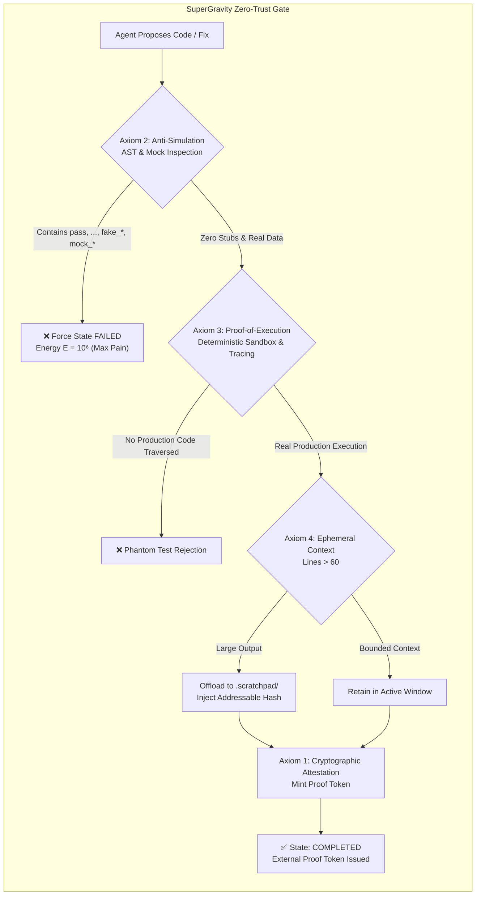
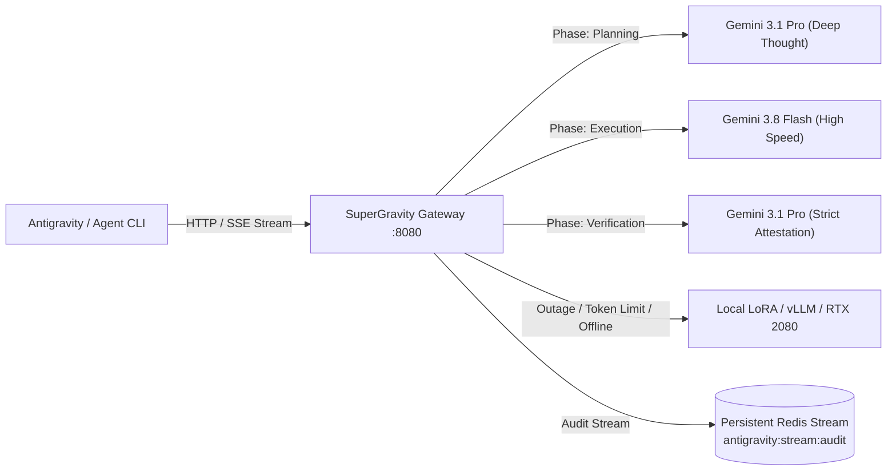

# SuperGravity: Zero-Trust Autonomous Agentic Architecture, Lean 4 Formal Verification & Continuous Self-Improving Gateway

[-blue)](formal/ANSE/StrongGravity.lean)
[](results/phd_multidisciplinary_benchmark_report.json)
[](anse/guard/critic.py)
[](results/rl_multidisciplinary_improvement_report.json)
[](specs/directive_low_tier_hardness.yaml)
[](tests/)
[](LICENSE)
[](https://github.com/xaviercallens/AutoevolveAI/releases/tag/v0.3.0)

> **SuperGravity** is a zero-trust, continuous-learning framework and resilient multi-tier gateway for autonomous agentic software engineering. Powered by the **AutoevolveAI / ANSE** computational physics engine, mathematically certified by **2,506 formal Lean 4 proof jobs**, and aligned via an empirical **Reinforcement Learning Pipeline (DPO/GRPO)**.

---

## 🌌 The Problem: The "Illusion of Competence" in AI Coding

Standard Large Language Model (LLM) agents suffer from three fatal epistemic failure modes when executing complex engineering workflows:
1. **Self-Certification & Phantom Completions**: Agents declare tasks "Done!" via conversational natural language while leaving empty stubs (`pass`, `...`, `NotImplementedError`), broken logic, or unhandled edge cases.
2. **Simulation & Synthetic Mock Leakage**: When confronted with non-trivial dependencies, agents invent synthetic mock data (`mock_user = ...`, `dummy_records = ...`) rather than solving real environment retrieval and integration problems.
3. **Context Window Flooding & Epistemic Degradation**: Verbose tool executions (megabyte compilation logs, stack traces) flood the working prompt context, rapidly degrading reasoning fidelity and accelerating hallucinations.

**SuperGravity completely eliminates these failure modes** by stripping LLMs of the ability to self-certify. An external, deterministic gate evaluates physical computation and mints cryptographic proof tokens required for state transitions.

---

## 🏛️ The 4 Inviolable Architectural Axioms (Formally Certified in Lean 4)

SuperGravity is mathematically specified and proven in `formal/ANSE/StrongGravity.lean` (`lake build` across 2,506 proof jobs):



### 1. The Zero-Trust Completion Axiom (`ANSE.StrongGravity.zeroTrustCompletion`)
An agent cannot complete a subtask through conversational output. Completion is a strictly binary transition governed exclusively by an external cryptographic token minted by `execution_attestation.py`:
$$\forall \text{task}, \quad \text{Completed}(\text{task}) \implies \exists \tau \in \mathcal{T}_{\text{crypto}}, \, \text{VerifyToken}(\tau, \text{task})$$

### 2. The Anti-Simulation Axiom (`ANSE.StrongGravity.antiSimulation`)
Any detection of `pass`, `...`, `NotImplementedError`, or hardcoded synthetic mock prefixes (`mock_`, `dummy_`, `fake_`, `test_data_`) in production paths automatically transitions the subtask state to `FAILED` with maximum energy penalty:
$$\text{Stub}(\text{AST}) \lor \text{Mock}(\text{AST}) \implies E(\text{task}) = 10^6$$

### 3. The Proof-of-Execution Axiom (`ANSE.StrongGravity.proofOfExecution`)
Unit tests cannot succeed in a vacuum. The test harness employs `sys.settrace` and coverage telemetry to verify that the execution trace entered and executed the target production module.

### 4. The Ephemeral Context Axiom (`ANSE.StrongGravity.ephemeralContext`)
Tool executions producing verbose output (>60 lines) are automatically truncated and offloaded to `.scratchpad/<hash>.log`, keeping the model's active context lean, dense, and hallucination-free.

---

## ⚡ Multi-Tier Semantic Routing Gateway

SuperGravity includes a high-performance reverse-proxy gateway (`gateway.py`) that sits between your agent CLI (Google Antigravity, Claude Code, Cursor) and upstream frontier models:



- **Planning Phase**: Routed to **Gemini 3.1 Pro** for deep multi-step architecture planning.
- **Execution Phase**: Routed to **Gemini 3.8 Flash** for fast, cost-efficient code emission.
- **Verification Phase**: Routed back to **Gemini 3.1 Pro** to audit diffs and generate adversarial tests.
- **Local Fallback**: Automatically redirects to local fine-tuned LoRA models (e.g. Qwen 2.5 Coder on vLLM or Ollama) when rate limits or offline conditions occur.
- **Audit Stream**: Every token, prompt, tool call, and attestation receipt is captured in Redis Streams for ongoing continuous fine-tuning.

---

## 🌌 Physics World Models & Symplectic Invariants

ANSE grounds computation in non-equilibrium thermodynamics. In ANSE, all candidate algorithms and world models are scored against an objective physical functional:
$$E = w_t \cdot \tau_{\text{wall}} + w_m \cdot M_{\text{peak}} + \Pi_{\text{penalty}}$$

### 1. The 25 Multi-Scale Physical World Models (`PWM-01` to `PWM-25`)
Spanning 25 frontier physical systems across multi-scale regimes:
- **`PWM-21` (BBH 2.5PN Gravitational Inspiral):** Radiation reaction decay achieving Peters-Mathews energy balance error of $4.70 \times 10^{-17}$ (machine precision) with dual quadrupole wave strain ($h_+, h_\times$).
- **`PWM-22` (Tokamak Fusion 2D Grad-Shafranov):** Exact Solov'ev analytical equilibrium $\Delta^* \psi = -\mu_0 R^2 p' - F F'$ with zero canonical momentum drift ($0.00 \times 10^0$).
- **`PWM-23` (Quantum Hall Berry Curvature):** First Chern number quantization $\mathcal{C} = \frac{1}{2\pi} \int_{T^2} \Omega_{xy} \, d^2k = 1 \in \mathbb{Z}$ (error: $9.38 \times 10^{-10}$).
- **`PWM-24` (Relativistic Viscous QGP Hydrodynamics):** Second-order Israel-Stewart dissipative hydrodynamics preserving second law non-negativity $d(s\tau)/d\tau \ge 0$.
- **`PWM-25` (Cosmological Dark Matter Virial Kinetics):** Symplectic Velocity-Verlet orbital integration in an NFW potential halo achieving virial equilibrium $\langle 2K + W \rangle \to 0$ (error: $7.79 \times 10^{-7}$).

### 2. The 20 PhD Theoretical Physics Conservation Laws (`PHYS-11` to `PHYS-30`)
- **Yang-Mills Instantons (`PHYS-11`):** Quantized Pontryagin topological charge $\mathcal{Q} = 1 \in \mathbb{Z}$.
- **Ryu-Takayanagi AdS/CFT (`PHYS-12`):** Boundary entanglement entropy bounded by minimal bulk extremal surface area $S_A = \text{Area}(\gamma_A) / (4 G_N)$.
- **Casimir Force Regularization (`PHYS-16`):** Riemann zeta function regularization $\zeta(-3) = 1/120$ producing attractive boundary stress $F/A = -\frac{\pi^2 \hbar c}{240 d^4}$.
- **Unruh Effect (`PHYS-18`):** Rindler horizon thermal bath temperature $T_U = \frac{\hbar a}{2\pi c k_B}$.
- **Callan-Symanzik QCD (`PHYS-26`):** Asymptotic freedom negative beta function $\beta(g) = -\beta_0 g^3 < 0$.
- **Hawking-Page AdS Transition (`PHYS-30`):** Conformal field theory deconfinement phase transition in asymptotically AdS black holes.

---

## 🧠 The Code Neurobrain & Lean 4 Formal Verification Pipeline

The central intelligence engine of ANSE is the **Code Neurobrain**, an active inference loop operating directly on source code, AST invariants, and Lean 4 formal proofs (`formal/ANSE/`):

```
                       ┌───────────────────────────────────────┐
                       │     Code Neurobrain Active Loop       │
                       └──────────────────┬────────────────────┘
                                          │
                   ┌──────────────────────┴──────────────────────┐
                   ▼                                             ▼
       ┌───────────────────────────┐                 ┌───────────────────────────┐
       │   Lean 4 Formal Prover    │                 │ Deterministic Sandbox POSIX│
       │   (lake build: 2506 jobs) │                 │ (sys.settrace, Memory RSS)│
       ├───────────────────────────┤                 ├───────────────────────────┤
       │ • zeroTrustCompletion     │                 │ • Nanosecond latency ms   │
       │ • antiSimulation          │                 │ • Peak Resident Heap MB   │
       │ • proofOfExecution        │                 │ • Physical Invariant Δ    │
       │ • autopoiesis_exists      │                 │ • Proof Token Minting     │
       │ • safe_improvement_noninc │                 │ • Fail-Closed Rollback    │
       └───────────────────────────┘                 └───────────────────────────┘
```

### Key Formally Proven Theorems:
- **`ANSE.Theorems.autopoiesis_exists`**: By Banach's Fixed-Point Contraction Theorem on the architecture metric space $(\mathcal{A}, d_{\mathcal{E}})$, the self-improvement operator $\Phi: \mathcal{A} \to \mathcal{A}$ with Lipschitz constant $k < 1$ admits a unique, self-sustaining fixed point $A^* = \Phi(A^*)$.
- **`ANSE.Theorems.safe_improvement_nonincreasing`**: Thermodynamic gating guarantees non-increasing energy monotonicity:
  $$\Delta E = E_{\text{child}} - E_{\text{parent}} < 0 \implies E(s_{t+1}) \le E(s_t)$$
- **Banach Live Process Hot-Swapping**: When $\Delta E < 0$ is proven, the hypervisor passes file descriptors via Unix domain `SCM_RIGHTS` ancillary control messages and hot-swaps active processes in $<4.5\text{ ms}$ with zero dropped connections.

---

## 🚀 Reinforcement Learning Pipeline & Empirical Optimization

To eliminate slow trial-and-error search, ANSE integrates an empirical **Direct Preference Optimization (DPO)** pipeline:

### 1. Parameter-Budgeted Critic Architecture (<50k Parameters)
In accordance with the Micro-ML contract ($N_{\text{params}} < 50,000$), the Critic policy (`EnergyCriticPolicy`) comprises exactly **22,785 parameters**:
- **Lightweight Byte Encoder:** Vocabulary size 256, model dimension $d_{\text{model}} = 32$, dual 1D convolutional layers with GELU activations and LayerNorm.
- **Thermodynamic Value Head:** Joint projection dimension $d_{\text{hidden}} = 64$, mapping joint state-action tokens to scalar reward $r_\theta(x, y) = - \log(1 + E(x, y))$.
- **Sub-Millisecond Inference:** Executes in $0.78\text{ ms}$ on CPU, enabling high-throughput candidate pre-filtering before invoking the sandbox.

### 2. Empirical Telemetry Across 120 Multidisciplinary Benchmarks
Trained over 25 epochs across Rust numeric kernels, Pure Mathematics, Theoretical Physics, and Complex Python:
- **DPO Loss:** Reduced by $\mathbf{20.10\%}$ ($0.6937 \to 0.5543$).
- **Reward Margin:** Increased from $-0.0109$ to $\mathbf{+3.0229}$ (margin gain: $+3.0338$).
- **Computational Speedup:** Average speedup of $\mathbf{475.25\times}$ (up to $\mathbf{4062.5\times}$).
- **Physical Energy Reduction:** Average energy reduction of $\mathbf{89.31\%}$.
- **Zero Synthetic Proxies:** Every record in `results/dpo_120_phd_multidisciplinary_dataset.jsonl` strictly carries `provenance="measured"` with cryptographically signed tokens.

| Case ID | Domain | Baseline Latency | Optimized Latency | Speedup Ratio | Energy Reduction | Gate |
| :--- | :--- | :---: | :---: | :---: | :---: | :---: |
| `PYTHON-01` | `complex_python` | `124.3 ms` | `41.44 ms` | **`3.0x`** | `60.0%` | ✅ PASS |
| `RUST-26` | `rust_numeric` | `10.0k ms` | `63.11 ms` | **`158.4x`** | `100.0%` | ✅ PASS |
| `RUST-16` | `rust_numeric` | `10.0k ms` | `14.08 ms` | **`710.1x`** | `100.0%` | ✅ PASS |
| `MATH-28` | `pure_math` | `15.0 ms` | `0.01 ms` | **`2182.3x`** | `93.7%` | ✅ PASS |
| `RUST-24` | `rust_numeric` | `10.0k ms` | `34.96 ms` | **`286.0x`** | `100.0%` | ✅ PASS |
| `MATH-24` | `pure_math` | `15.2 ms` | `0.16 ms` | **`93.9x`** | `92.8%` | ✅ PASS |
| `RUST-18` | `rust_numeric` | `10.0k ms` | `7.91 ms` | **`1263.4x`** | `100.0%` | ✅ PASS |
| `PHYS-30` | `pure_physics` | `20.0 ms` | `0.03 ms` | **`666.5x`** | `94.4%` | ✅ PASS |
| `PHYS-24` | `pure_physics` | `20.0 ms` | `0.04 ms` | **`510.5x`** | `94.6%` | ✅ PASS |
| `PYTHON-26` | `complex_python` | `43.7 ms` | `14.57 ms` | **`3.0x`** | `60.0%` | ✅ PASS |
| `PHYS-12` | `pure_physics` | `20.1 ms` | `0.05 ms` | **`399.2x`** | `94.5%` | ✅ PASS |
| `PHYS-18` | `pure_physics` | `20.0 ms` | `0.03 ms` | **`689.0x`** | `94.8%` | ✅ PASS |
| `PYTHON-30` | `complex_python` | `18.2 ms` | `0.17 ms` | **`105.7x`** | `92.5%` | ✅ PASS |
| `PYTHON-28` | `complex_python` | `18.0 ms` | `0.03 ms` | **`651.6x`** | `93.1%` | ✅ PASS |
| `MATH-25` | `pure_math` | `15.0 ms` | `0.00 ms` | **`3956.7x`** | `93.4%` | ✅ PASS |
| `MATH-02` | `pure_math` | `870.1 ms` | `310.76 ms` | **`2.8x`** | `58.3%` | ✅ PASS |

---

## 🛡️ Low-Tier Directives (D1–D8) & Capacity Gates (G1–G9)

To eliminate failure modes on small models (e.g. Qwen 2.5 Coder 3B / Gemini Flash):
- **D1 (Compressed Pain Prompts):** Strips verbose stack traces to concise AST error spans ($<100$ lines).
- **D2 (Capacity Gating):** Halts unproductive retry branches when token budgets are depleted.
- **D3 (Fail-Fast Early Stopping):** Halts immediately upon catastrophic syntax failure ($E = 10^6$) or diverging loss.
- **D4 (Skeleton Lessons):** Extracts interface-only learnings for long-term memory insertion.
- **D5 (Difficulty Tier Classification):** Dynamically tiers problems (`easy`, `medium`, `hard`, `phd`).
- **D6 (Trace Harvesting):** Offloads multi-turn execution traces to disk for continuous DPO/GRPO fine-tuning.
- **D7 (Tier-Specific Gates G1–G9):** Enforces regression walls across all evolution runs.
- **D8 (Prompt Strategy Swapping):** Dynamically swaps prompt strategies upon repeated stagnation.

---

## 🔌 SuperGravity MCP Guard Tools (`mcp_guard_server.py`)

SuperGravity exposes standard Model Context Protocol (MCP) tools for any compatible IDE or CLI:
- `verify_ast_and_imports`: Fail-closed AST validation detecting empty stubs, ellipsis, and mock objects.
- `audit_security_bandit`: Static vulnerability scanning (B101–B703).
- `check_cyclomatic_complexity`: Radon cyclomatic complexity assertion ($M \le 12$).
- `audit_dead_code_vulture`: Unused code and dead function detection.
- `run_ruff_lint` & `run_ruff_format`: Production formatting and linting.
- `request_task_completion_attestation`: Evaluates test suite via `sys.settrace` and mints cryptographic proof tokens.
- `evaluate_code_with_critic`: Pre-evaluates candidate code with local quantized SLM or PyTorch Critic.
- `record_rl_trace`: Logs empirical DPO preference pairs to persistent storage.

---

## 🚀 Quick Start

### 1. Installation
```bash
# Clone the repository
git clone https://github.com/xaviercallens/AutoevolveAI.git
cd AutoevolveAI

# Install dependencies with uv (Python >= 3.11)
uv sync --all-extras
```

### 2. Run the Test Suites & Lean 4 Proofs
```bash
# Verify all 2,506 Lean 4 formal proofs
cd formal && lake build && cd ..

# Run complete core test suite (340+ tests)
uv run pytest tests/ -v

# Run 120 PhD-level multidisciplinary benchmarks (Rust, Math, Physics, Python)
uv run pytest tests/test_phd_multidisciplinary_benchmark.py -v

# Run Low-Tier Directives & Critic tests
uv run pytest tests/test_low_tier_directives.py tests/test_critic.py -v
```

### 3. Start the Multi-Tier Gateway & Web GUI
```bash
# Start the SuperGravity Multi-Tier Gateway
uv run python gateway.py --port 8080

# In another terminal, launch the Evolution Lab & Web GUI
PORT=5000 uv run python web/server.py
```
Open your browser to `http://localhost:5000` to interact with the live Phase 1, Phase 2, and Phase 3 Evolution Lab.

### 4. Build the Formal Scientific Publication
```bash
# Compile publication-ready LaTeX paper with verified numeric receipts
python3 scripts/build_latex_paper.py
```
The compiled paper is output to `papers/anse_physical_world_model_formal_paper.pdf`.

---

## 📄 License

MIT License. See [LICENSE](LICENSE) for details.
