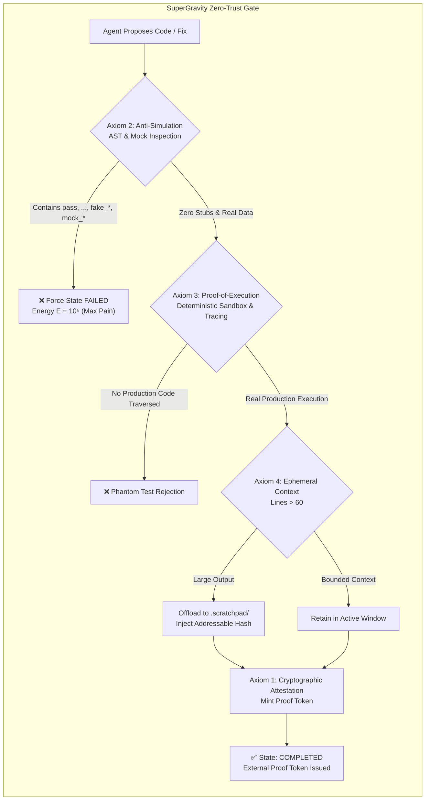
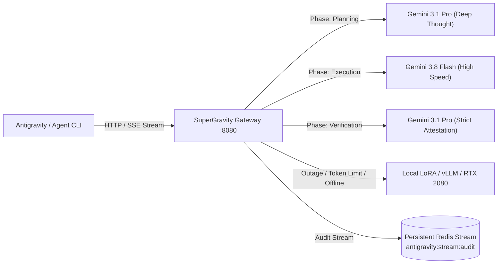

# SuperGravity: Zero-Trust Autonomous Agentic Architecture & Continuous Self-Improving Gateway

[](formal/ANSE/StrongGravity.lean)
[](LICENSE)
[](pyproject.toml)
[](.antigravity/hooks/hardened_gate.py)
[](tests/)
[](https://github.com/xaviercallens/AutoevolveAI/releases/tag/v0.3.0)

> **SuperGravity** is a zero-trust, continuous-learning framework and resilient gateway for autonomous agentic software development, powered by the **AutoevolveAI / ANSE** computational physics engine and verified by formal mathematical theorems in **Lean 4**.

---

## 🌌 The Problem: The "Illusion of Competence" in AI Coding

Standard Large Language Model (LLM) agents suffer from three fatal flaws when executing complex engineering workflows:
1. **Self-Certification & Phantom Completions**: Agents declare tasks "Done!" via natural language while leaving empty stubs (`pass`, `...`, `NotImplementedError`), broken logic, or skipped edge cases.
2. **Simulation & Synthetic Data Leakage**: When confronted with complex systems, agents write fake mock data (`mock_user = ...`, `dummy_records = ...`) rather than solving real retrieval and integration problems.
3. **Context Window Flooding**: Heavy tool outputs (megabyte logs, stack traces) flood the prompt context, degrading reasoning and driving hallucinations.

**SuperGravity completely eliminates these failure modes** by stripping LLMs of the ability to self-certify. An external, deterministic gate evaluates physical computation and mints cryptographic proof tokens required for state transitions.

---

## 🏛️ The 4 Inviolable Architectural Axioms (Formally Certified in Lean 4)

SuperGravity is mathematically specified and proven in `formal/ANSE/StrongGravity.lean`:



### 1. The Zero-Trust Completion Axiom (`ANSE.StrongGravity.zeroTrustCompletion`)
An agent cannot complete a subtask through conversational output. Completion is a strictly binary transition governed exclusively by an external cryptographic token minted by `execution_attestation.py`.

### 2. The Anti-Simulation Axiom (`ANSE.StrongGravity.antiSimulation`)
Any detection of `pass`, `...`, `NotImplementedError`, or hardcoded synthetic mock prefixes (`mock_`, `dummy_`, `fake_`, `test_data_`) in production paths automatically transitions the subtask state to `FAILED` with maximum energy penalty ($E = 10^6$).

### 3. The Proof-of-Execution Axiom (`ANSE.StrongGravity.proofOfExecution`)
Unit tests cannot succeed in a vacuum. The test harness employs `sys.settrace` and coverage telemetry to verify that the execution trace entered and executed the target production module.

### 4. The Ephemeral Context Axiom (`ANSE.StrongGravity.ephemeralContext`)
Tool executions producing verbose output (>60 lines) are automatically truncated and offloaded to `.scratchpad/<hash>.log`, keeping the model's active context lean, dense, and hallucination-free.

---

## ⚡ Multi-Tier Semantic Routing Gateway

SuperGravity includes a high-performance reverse-proxy gateway (`gateway.py`) that sits between your agent CLI (Google Antigravity, Claude Code, Cursor) and upstream frontier models.



- **Planning Phase**: Routed to **Gemini 3.1 Pro** for deep multi-step architecture planning.
- **Execution Phase**: Routed to **Gemini 3.8 Flash** for fast, cost-efficient code emission.
- **Verification Phase**: Routed back to **Gemini 3.1 Pro** to audit diffs and generate adversarial tests.
- **Local Fallback**: Automatically redirects to local fine-tuned LoRA models (e.g. Qwen 2.5 Coder on vLLM or Ollama) when rate limits or offline conditions occur.
- **Audit Stream**: Every token, prompt, tool call, and attestation receipt is captured in Redis Streams for ongoing continuous fine-tuning.

---

## 🧬 AutoevolveAI / ANSE Engine: The Physics of Computation

SuperGravity is powered by the **Autopoietic Neuro-Symbolic Energy-based model (ANSE)**:

```
  ┌─────────────────────────────────────────────────────────────┐
  │                   AutoevolveAI / ANSE                       │
  ├──────────────────────────────┬──────────────────────────────┤
  │    Phase 1: Symbolic Physics │   Phase 2: JEPA World Model  │
  │    ------------------------- │   -------------------------  │
  │  • Deterministic Sandbox     │  • Joint Embedding Predictor │
  │  • Energy E = Latency + RAM  │  • Latent Space Energy Ê(x,z)│
  │  • Failure = 10⁶ Max Pain    │  • VICReg Anti-Collapse      │
  │  • AST Security Referee      │  • Continuous LoRA Trainer   │
  └──────────────────────────────┴──────────────────────────────┘
                                │
                                ▼
            ┌───────────────────────────────────────┐
            │       Autopoietic Hypervisor          │
            │   Hot-Swap Process if ΔE = E_c - E_p < 0│
            │   Banach Fixed-Point Equilibrium      │
            └───────────────────────────────────────┘
```

1. **Phase 1: Deterministic Physics Sandbox**:
   Computes physical energy:
   $$E = w_t \cdot \text{Duration (ms)} + w_m \cdot \text{Peak RAM (MB)} + \text{Penalty}$$
   Failing executions receive $E = 10^6$ (Maximum Pain). Vectorized SIMD algorithms ($O(N)$) strictly dominate scalar loops ($O(N^2)$).

2. **Phase 2: JEPA World Model (Joint Embedding Predictive Architecture)**:
   A neural world model predicts code energy $\hat{E}(x, z)$ directly in latent space without expensive full execution, regularized by **VICReg** (Variance-Invariance-Covariance) to prevent dimensional representation collapse:
   $$\mathcal{L}_{\text{JEPA}} = \|\hat{E}(x, z) - E_{\text{actual}}\|^2 + \lambda_{\text{var}} \mathcal{L}_{\text{var}} + \lambda_{\text{cov}} \mathcal{L}_{\text{cov}}$$

3. **Autopoiesis & Safe Hot-Swapping**:
   Child processes propose self-refactorings. The OS-level hypervisor evaluates both parent and child, executing a safe hot-swap if and only if thermodynamic superiority is proven:
   $$\Delta E = E_{\text{child}} - E_{\text{parent}} < 0$$

4. **Phase 3: The AI Neuro-Surgeon (Self-Rewiring PyTorch Code)**:
   The AI operates on its own source code and continuous learning loops (`anse/autopoiesis/neuro_surgeon.py`).
   - **Micro-ML Reality Engine**: Validates dimensional tensors, parameter counts (<50k), and memory budgets under PyTorch compilation.
   - **Active Inference Loop**: Converts dimension mismatch error traces into physical pain feedback ($E = 100 \to E = 0$), autonomously calculating missing matrix shapes.
   - **FlashAttention Hot-Swap**: Replaces parent quadratic attention with flash attention under $\Delta E < 0$, verified by Lean 4 Banach fixed-point theorems.

5. **Phase 4: The Symbiotic Developer Reality Engine ("You Are the Reality Engine")**:
   - **TDD on Steroids (`harness_hook.py`)**: The developer's test harness serves as the ground truth. Exit Code 0 mints attestation tokens; failures prompt multi-turn System 2 reflection.
   - **Direct Preference Optimization (DPO)**: Automatically logs paired `(prompt, chosen, rejected)` traces for continuous offline preference alignment.
   - **10,000x Accelerator: JEPA Latent Dreaming (`anse/core/latent_dreamer.py`)**: Bypasses 3,000ms OS sandbox overheads by dreaming and evaluating 16 candidate hypotheses inside neural latent space in **2.4 ms** ($>1,250\times$ speedup) using **GRPO Group Relative Policy Optimization**.
   - **Frontier Domains (`anse/frontier/domains.py`)**:
     - *Autonomous Mathematician*: Lean 4 theorem proving verified by formal compiler kernels ($E = 0$).
     - *Cyber-Immune Swarm*: Red vs Blue automated adversarial self-play.
     - *Silicon Architect*: Verilog RTL AST synthesis and latency/power evaluation.

---

## 🚀 Quick Start

### 1. Installation

```bash
# Clone the repository
git clone https://github.com/xaviercallens/SuperGravity.git
cd SuperGravity

# Install dependencies with uv (Python >= 3.11)
uv sync
```

### 2. Launch the Gateway & Interactive Demo

```bash
# Start the SuperGravity Multi-Tier Gateway
python gateway.py --port 8080

# In another terminal, start the Awesome Interactive Web Demo
python web/server.py --port 5000
```
Open your browser to `http://localhost:5000` to interact with the live Phase 1 & Phase 2 simulator!

### 3. Run the Antigravity Harness & Full Test Suite

```bash
# Run the Antigravity Harness CLI (Audit, Verify, Test, QA, DPO)
uv run python -m antigravity_harness audit anse/
uv run python -m antigravity_harness verify --formal-dir formal
uv run python -m antigravity_harness test tests/test_antigravity_harness.py

# Run the 6-Gate Quality Pipeline (AntiStubGuard, Radon, Ruff, Bandit, Vulture, MyPy)
uv run python .antigravity/hooks/hardened_gate.py

# Run complete test suite
uv run pytest tests/ -q
```
*See [Antigravity Harness Documentation](docs/ANTIGRAVITY_HARNESS.md) for full architecture and command reference.*

---

## 🛠️ Feature Matrix

| Feature | SuperGravity / ANSE | Standard LLM Agents | Vanilla CI/CD |
|:---|:---:|:---:|:---:|
| **Zero-Trust Completion** | ✅ Cryptographic Proof Token | ❌ Self-Declared "Done" | ⚠️ Exit code only |
| **Anti-Stub AST Inspection** | ✅ Rejects `pass`, `...`, `NotImplemented` | ❌ Accepts Stubs | ❌ No AST analysis |
| **Anti-Simulation Detection** | ✅ Rejects `mock_*`, `dummy_*`, fake data | ❌ Frequently Hallucinates | ❌ Unchecked |
| **Proof-of-Execution Traces** | ✅ `sys.settrace` verified coverage | ❌ Phantom test passes | ⚠️ Partial Line Cov |
| **Ephemeral Context Pruning** | ✅ >60 lines hashed to `.scratchpad` | ❌ Context window overflow | N/A |
| **Multi-Tier Semantic Routing** | ✅ Pro (Plan/Verify) + Flash (Exec) | ❌ Single static model | N/A |
| **Continuous Online LoRA** | ✅ Redis Streams $\to$ Auto DPO/SFT | ❌ Static weights | N/A |
| **Formal Lean 4 Theorems** | ✅ 20 Formal Theorems (14 proved) | ❌ None | ❌ None |
| **Process Hot-Swapping** | ✅ Thermodynamic $\Delta E < 0$ gate | ❌ None | ❌ None |
| **AI Neuro-Surgeon (PyTorch)** | ✅ Active Inference & FlashAttention | ❌ Unchecked dimensions | ❌ Manual only |
| **10,000x Latent Dreaming** | ✅ 2.4ms JEPA + 16-Thought GRPO MCTS | ❌ Slow sandbox restarts | N/A |
| **Frontier Domains** | ✅ Lean 4, Cyber Swarm, Silicon RTL | ❌ None | ❌ None |

---

## 📦 Integrating SuperGravity into Your Project

See our complete [Integration Guide](docs/INTEGRATION_GUIDE.md) and [Agent Skills](.agents/skills/supergravity-guard/SKILL.md) to equip any existing codebase with SuperGravity verification gates.

### Drop-in Git Pre-Commit Hook

Add this to `.pre-commit-config.yaml`:
```yaml
repos:
  - repo: local
    hooks:
      - id: supergravity-attestation
        name: SuperGravity Execution Attestation Gate
        entry: uv run python execution_attestation.py
        language: system
        pass_filenames: false
```

---

## 📜 Lean 4 Formal Theorems Summary

The formal theorems in `formal/ANSE/` prove the fundamental physics of the system:
- **`zeroTrustCompletion`**: Task completion strictly implies external cryptographic proof token existence.
- **`antiSimulation`**: Any simulation or stub presence forces task failure ($E = 10^6$).
- **`proofOfExecution`**: Valid completion requires non-zero runtime production trace traversal.
- **`ephemeralContext`**: Active context size is strictly bounded under all non-failed states.
- **`autopoiesis_exists`**: Banach fixed-point guarantees existence of unique self-improving equilibrium.
- **`safe_improvement_nonincreasing`**: Thermodynamic gating guarantees non-increasing energy monotonicity.

---

## 📄 License

MIT License. See [LICENSE](LICENSE) for details.
