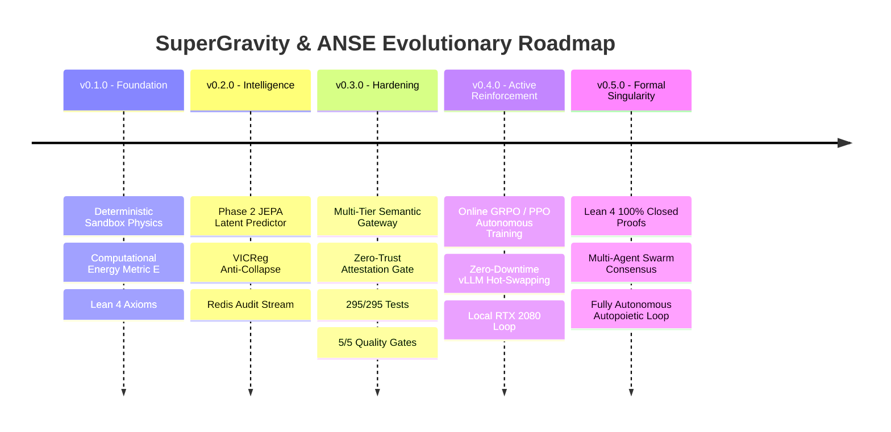

# SuperGravity & AutoevolveAI / ANSE — Architecture Roadmap

> **Target Release**: Continuous Multi-Phase Evolution  
> **Status**: v0.3.0 Released | v0.4.0 In Active Development  

---

## 🗺️ Architectural Phase Overview

---

## 📍 Phase Status & Detailed Breakdown

### Phase 1: Symbolic Execution & Computational Physics Sandbox (Completed ✅)
*Focus: Grounding code evaluation in objective, physical hardware energy.*
- [x] **Two-Tier Execution Sandbox**: Fast Subprocess Tier-1 + Docker Tier-2 containment.
- [x] **Physical Energy Function ($E$)**:
  - $E = w_t \cdot \text{Duration (ms)} + w_m \cdot \text{Peak RAM (MB)} + \text{Penalty}$
  - Catastrophic backtracking, timeouts, and syntax errors trapped with $E = 10^6$ (Maximum Pain).
- [x] **Anti-Hallucination AST Security Referee**:
  - Rejection of unauthorized network, OS mutation, and phantom imports.
- [x] **Formal Lean 4 Specifications**:
  - Theorems P1–P7 proved in `formal/ANSE/Performance.lean`: energy non-negativity, maximal pain supremacy, speedup monotonicity, vectorization advantage.

---

### Phase 2: Micro-ML Architecture & JEPA World Model (Completed ✅)
*Focus: Predicting computational outcome in latent space without full execution.*
- [x] **Joint Embedding Predictive Architecture (JEPA)**:
  - World model trained on offline and online harvested code execution traces.
  - Latent space energy prediction $\hat{E}(x, z) \approx E_{\text{actual}}$.
- [x] **VICReg Regularization (Anti-Collapse)**:
  - Variance hinge loss + Covariance decorrelation preventing dimensional collapse.
- [x] **EMA Target Encoder Update**:
  - Stable exponential moving average update proven to be a convex combination.
- [x] **Trace Harvester**:
  - Append-only interaction logging to JSONL + ChromaDB semantic vector search.

---

### Phase 3: Zero-Trust Hardening & Multi-Tier Gateway (v0.3.0 Released ✅)
*Focus: Stripping LLMs of self-certification; multi-tier semantic proxy.*
- [x] **The 4 Zero-Trust Axioms formalized in Lean 4 (`StrongGravity.lean`)**:
  - Zero-Trust Completion (cryptographic token).
  - Anti-Simulation (AST rejects `pass`, `...`, `NotImplementedError`, `mock_*` synthetic data).
  - Proof-of-Execution (`sys.settrace` verified production coverage).
  - Ephemeral Context Offloading (>60 lines offloaded to `.scratchpad/`).
- [x] **FastAPI Multi-Tier Resilient Reverse Proxy (`gateway.py`)**:
  - Planning $\to$ Gemini 3.1 Pro.
  - Execution $\to$ Gemini 3.8 Flash.
  - Verification $\to$ Gemini 3.1 Pro.
  - Failover $\to$ Local LoRA (Qwen 2.5 Coder on vLLM / Ollama).
  - Persistent Redis Stream buffering (`antigravity:stream:audit`).
- [x] **Deterministic Attestation Gate (`execution_attestation.py`)**:
  - Automated AST diff audit and cryptographic token generation.
- [x] **Strict 5-Gate Quality Pipeline (`hardened_gate.py`)**:
  - Radon Cyclomatic Complexity $\le 10$ across all 90 source files.
  - Ruff PEP8 + Bandit Security + Vulture Dead Code + MyPy Static Typing.
- [x] **Comprehensive Test Suite**:
  - 295/295 tests passing cleanly.

---

### Phase 4: Continuous Online Reinforcement Learning (v0.4.0 — In Progress 🚧)
*Focus: Closing the autonomous improvement loop with local hardware.*
- [ ] **Autonomous GRPO / PPO Agent Tuning (`train_grpo.py`)**:
  - Group Relative Policy Optimization on pairs harvested from Redis.
  - DPO preference pairs generated automatically from `(failed_attempt, attested_fix)`.
- [ ] **Runtime LoRA Hot-Swapping (`vllm_reloader.py`)**:
  - Exploiting `VLLM_ALLOW_RUNTIME_LORA_UPDATING=True` to reload newly trained weights on RTX 2080 without process restart.
- [ ] **Daily Self-Trainer Daemon (`daily_trainer_daemon.py`)**:
  - Cron/daemon that checks Redis stream watermarks, harvests verified delta traces, triggers LoRA fine-tuning, and reloads vLLM.

---

### Phase 5: Formal Mathematical Closure & Multi-Agent Swarm (v0.5.0 — Future 🔮)
*Focus: 100% formal proof closure in Lean 4 and decentralized multi-agent energy consensus.*
- [ ] **Closing Open Lean 4 Obligations**:
  - Formalize Varadhan's lemma / Laplace saddle-point convergence for soft free energy (`A2_freeEnergy_tendsto_hard`).
  - Formalize VICReg variance margin spread proof (`B6_vicreg_zero_implies_spread`).
  - Formalize System 2 gradient descent energy descent lemma (`C2_energy_descent_per_step`).
  - Formalize Polyak-Łojasiewicz linear convergence for soft-token pondering (`C3_ponder_convergence`).
- [ ] **Multi-Agent Thermodynamic Consensus**:
  - Swarm of specialized micro-agents negotiating code refactorings via peer energy validation.
  - Cryptographic verification certificates recorded on decentralized ledger.

---

## 📊 Milestone Summary

| Milestone | Target Version | Primary Deliverable | Status |
|:---|:---:|:---|:---:|
| **Physical Sandbox** | `v0.1.0` | Energy Function $E$ + Deterministic Sandbox | Done ✅ |
| **Latent Predictor** | `v0.2.0` | JEPA World Model + VICReg Regularization | Done ✅ |
| **Zero-Trust Gateway** | `v0.3.0` | Multi-Tier Gateway + Attestation Gate + Hardened Gate | Done ✅ |
| **Local LoRA Daemon** | `v0.4.0` | Autonomous DPO / GRPO + vLLM Hot-Swap on RTX 2080 | Active 🚧 |
| **Singularity Proof** | `v0.5.0` | 100% Lean 4 Proof Closure + Multi-Agent Swarm | Planned 🔮 |
