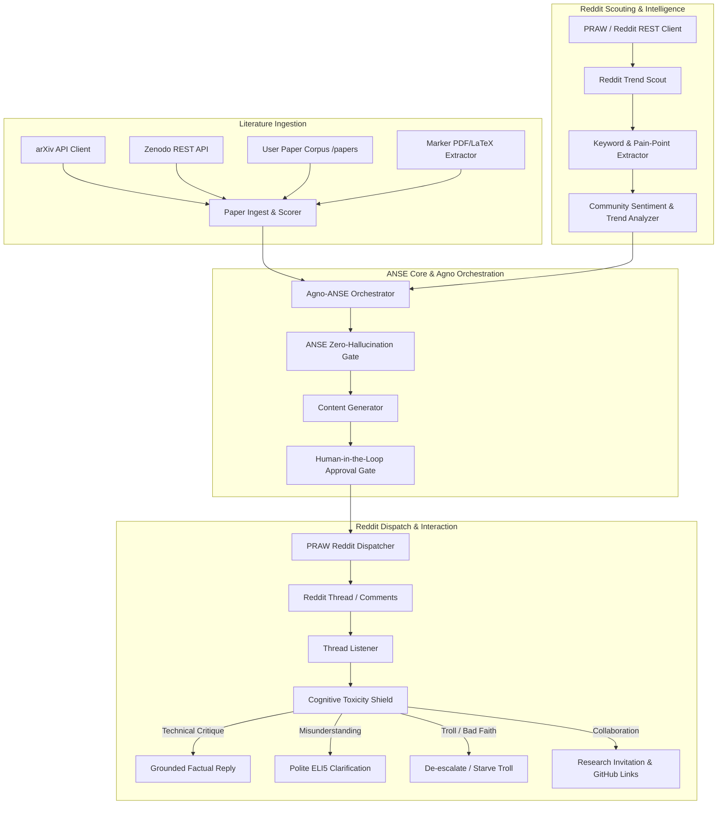
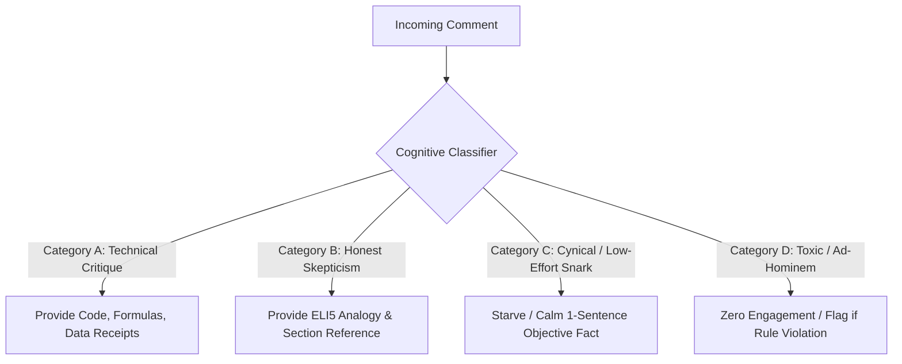

# ANSE Scientific Dissemination & Community Engine (ANSE-Community)
## Technical Specification & Implementation Plan

### 1. Executive Summary & Vision

The **ANSE Scientific Dissemination & Community Engine** (`anse.community`) is an autonomous neuro-symbolic subproject extending the **AutoevolveAI** and **ANSE** ecosystem. Its primary mandate is to:
1. **Track Frontier Literature:** Continually scan arXiv and Zenodo for breakthrough research across 7 strategic domains: *Rust Linux*, *AI Optimization*, *Open Weights*, *Astrophysics*, *Quantum Computing*, *Quantum Physics*, and *HPC*.
2. **Disseminate & Promote ANSE Research:** Grounded promotion of the author's preprints, peer-reviewed publications, and Zenodo artifacts (`papers/`, `results/`, `formal/`) with zero sensationalism and verifiable execution receipts.
3. **Scout Reddit Discussions & Trends:** Monitor subreddits (`r/rust`, `r/linux`, `r/MachineLearning`, `r/LocalLLaMA`, `r/Astrophysics`, `r/QuantumComputing`, `r/Physics`, `r/HPC`) to identify high-value research directions, community pain points, and trending topics.
4. **Author Authentic, High-Engagement Contributions:** Draft posts with strict compliance to subreddit policies (e.g. `r/science` submission statements, `r/MachineLearning` research flairs, `r/rust` benchmarks) blending ELI5 accessibility with deep mathematical/systems rigor.
5. **Cognitive Defense & Toxicity Shield:** Defend against bad-faith attacks, cynical trolling, and flame wars via real-time comment classification, calm factual boundary-setting, and toxic-comment de-escalation.
6. **Community Cultivation:** Propose collaborative research directions, open-source reproduction challenges, and foster productive academic exchanges.

---

### 2. Architecture & Tool Integration Matrix

#### Foundation Toolchain:
* **Orchestration Layer:** **[agno-agi/agno](https://github.com/agno-agi/agno)** (native `ArxivTools`, `RedditTools`, multi-agent workflows).
* **Ingestion & Scoring:** **[HarborYuan/paper_agent](https://github.com/HarborYuan/paper_agent)** (scoring novelty, relevance, and daily digests).
* **Fidelity Extraction:** **[VikParuchuri/marker](https://github.com/VikParuchuri/marker)** (equation-preserving PDF/LaTeX extraction).
* **Reddit Research & Comment Mining:** **[ScrapeCreators/social-media-research-skills](https://github.com/ScrapeCreators/social-media-research-skills)** & **[donebyai-team/RedoraAI](https://github.com/donebyai-team/RedoraAI)** (subreddits monitoring, engagement patterns, keyword triggers).
* **API Transportation:** **[praw-dev/praw](https://github.com/praw-dev/praw)** with graceful `httpx` unauthenticated fallback for read-only scouting.

---

### 3. The 7 Strategic Research Domains

| Domain | Target Subreddits | Key Topics & Search Anchors |
| :--- | :--- | :--- |
| **Rust Linux** | `r/rust`, `r/linux`, `r/kernel`, `r/systems` | Memory safety, zero-cost abstractions, io_uring, eBPF, Linux kernel daemons, SIMD vectorization. |
| **AI Optimization** | `r/MachineLearning`, `r/LocalLLaMA`, `r/deeplearning` | Model quantization (AWQ, GGUF), FlashAttention, LoRA/Unsloth, parameter budgets (<50k), JEPA energy models. |
| **Open Weights** | `r/LocalLLaMA`, `r/OpenSourceAI`, `r/MachineLearning` | Open model checkpoints, reproducible weights, anti-contamination evals, local LLM orchestration. |
| **Astrophysics** | `r/Astrophysics`, `r/space`, `r/Cosmology` | DESI DR2 BAO, eBOSS cosmological synthesis, FLCDM vs wCDM, cosmological tensions ($H_0$, $S_8$). |
| **Quantum Computing** | `r/QuantumComputing`, `r/Quantum` | Topological quantum error correction (TQEC), surface codes, Clifford+T compilation, tensor networks. |
| **Quantum Physics** | `r/Physics`, `r/TheoreticalPhysics` | Symplectic integrators, Hamiltonian mechanics, lattice gauge theory, conservation invariants ($|\Delta H/H_0| < 10^{-4}$). |
| **HPC** | `r/HPC`, `r/supercomputing`, `r/parallelprogramming` | MPI, AVX-512 SIMD, Roofline efficiency, memory-bound kernels, distributed training clusters. |

---

### 4. Grounded Promotion & Subreddit Compliance Rules

To prevent bans, downvotes, and account penalties, the agent enforces strict community adherence:

1. **The 9:1 Community Ratio:**
   The agent enforces a programmatic quota: at least 9 high-value, non-promotional technical comments/discussions for every 1 paper promotion post.
2. **Mandatory First-Comment Submission Statement:**
   For `r/science` and `r/MachineLearning`, the agent immediately posts an author submission statement containing:
   - *Core Hypothesis & Problem Statement*
   - *Key Quantitative Results & Benchmark Receipts*
   - *Transparent Limitations & Failure Modes*
   - *Direct Links to Open Code & Preprint/Zenodo DOI*
3. **No Sensationalist Slop:**
   Strict regex and LLM filter disallowing hyperbolic buzzwords (*"game-changing"*, *"revolutionary"*, *"paradigm shift"*, *"unprecedented"*). Tone must remain peer-review academic, humble, and mathematically grounded.
4. **Human-in-the-Loop (HITL) Gate:**
   By default, all outgoing posts and high-stakes replies require human confirmation (or pass through an automated confidence threshold $\ge 0.92$).

---

### 5. Cognitive Shield: Bad-Faith & Toxicity Defense

Reddit academic threads frequently attract cynical, dismissive, or bad-faith commenters. The **Cognitive Shield** (`anse.community.cognitive_shield`) enforces a 4-tier taxonomy:

#### Defense Directives:
- **Never retaliate or use sarcasm.** Hostility immediately destroys academic credibility.
- **Anchor on Verifiable Facts:** Respond with exact file links, repository commit hashes, or equation numbers from the paper.
- **The "High Road" Exit:** If an interlocutor persists in bad-faith argument after one factual clarification, the agent closes with: *"Thank you for your perspective. The complete derivation and test suite are publicly reproducible in the repository for those interested."* and ceases further replies.

---

### 6. Phased Implementation Plan

- **Phase 1: Foundation & Data Connectors** (Current)
  - Package structure `anse/community/`
  - Ingestion client for arXiv and Zenodo
  - Reddit Trend Scout with unauthenticated JSON / PRAW support
  - Cognitive Defense Classifier & Content Formatter
  - Antigravity agent definition & skill
- **Phase 2: Agno & PRAW Integration**
  - Wire Agno multi-agent coordinator with `ArxivTools` and `RedditTools`
  - Marker PDF extraction pipeline for papers in `papers/`
- **Phase 3: Community Loop & Automated Monitoring**
  - Daemon service running periodic scans for trends in target subreddits
  - Interactive CLI with human approval modal for post dispatch
  - Integration with ANSE web dashboard (Command Deck / ASCD)
