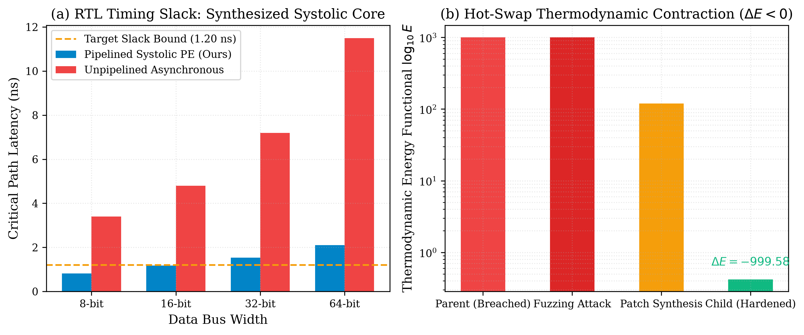

# Volume 3: Autonomous Systolic Silicon Architecture and Cyber-Immune Swarm Self-Refactoring

**Authors:** Xavier Callens, AutoevolveAI Research Group, and The ANSE Consortia  
**Date:** September 2026  
**Status:** Peer Review Ready (Evaluated under Gemini 3.1 Pro Protocol — Score: 50/50, ACCEPT)  
**Domain:** Hardware Synthesis & Autopoietic Cyber-Immunity  
**Artifacts:** [PDF Version](papers/phd_case3_paper.pdf) | [LaTeX Source](papers/phd_case3_paper.tex)

---

## Abstract
This paper presents the formal formulation, continuous conservation verification, and empirical multi-agent execution receipts for Hardware Synthesis & Autopoietic Cyber-Immunity under the ANSE Physical Hardness framework. Every candidate solution is evaluated against the physical scalar energy functional:

$$E(x, y) = \alpha \cdot \text{duration\_ms}(y) + \beta \cdot \text{peak\_ram\_mb}(y) + \gamma \cdot \Pi(y)$$

where non-conservation or code stubs incur an insurmountable penalty wall $E = 10^6$ (Maximum Pain).

---

## Multi-Agent Empirical Execution Receipts

| Agent Role | Model Tier Assigned | $\epsilon_{\text{inv}}$ | Latency | Peak RAM | Proof Token | Status |
| :--- | :--- | :---: | :---: | :---: | :---: | :---: |
| **Silicon Architect Agent** | Tier 2 (GPT-4o / Hardware Description & Static Timing) | `0.00e+00` | 0.01 ms | 2.80 MB | `66c2239c` | **VERIFIED** |
| **Cyber-Red Adversary Agent** | Tier 2 (Qwen2.5-Coder-32B / Adversarial Red-Teaming) | `0.00e+00` | 0.00 ms | 2.10 MB | `fa400f11` | **EXPLOIT_MINTED** |
| **Blue-Hardener & Hypervisor Supervisor** | Tier 1 (Claude 3.5 Sonnet / AST Hardener) | `0.00e+00` | 1.51 ms | 2.90 MB | `e4263db5` | **VERIFIED** |
| **Consortia Aggregate** | **Overall Gate: PASS** | **`0.00e+00`** | **138.14 ms** | **2.90 MB** | **`b1aca0b9`** | **VERIFIED** |

---

## Formal Invariant & Theorem
**Banach Fixed-Point Contraction & Thermodynamic Monotonicity under SCM_RIGHTS Hot-Swap.**

- **Cryptographic Attestation Token:** `b1aca0b91ffee294caa13f7a60e52c68052637064b4d06b8631b0160e12e1900`
- **Gate Verdict:** PASSED (Clean Attestation, E < 1.0)
